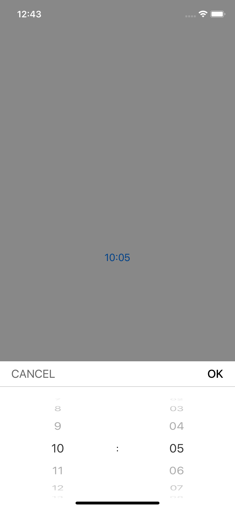
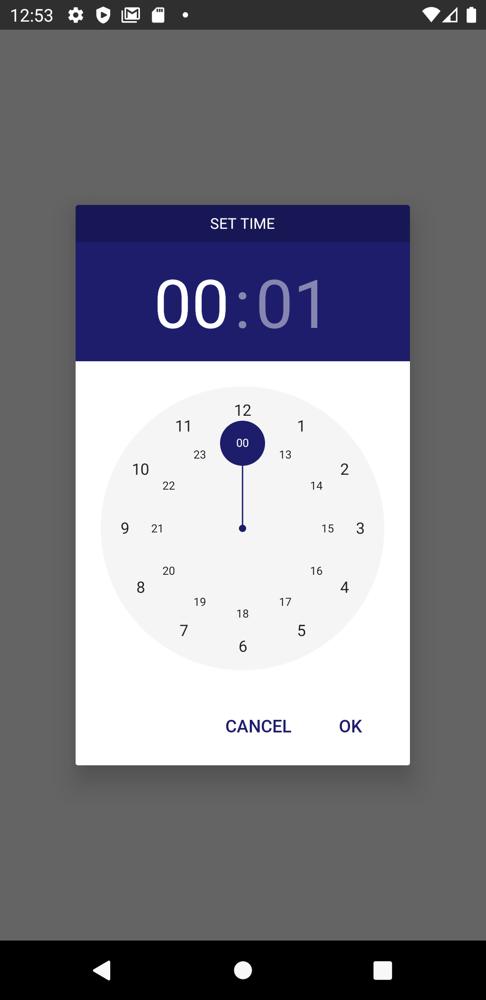

# Duration Picker



## Props

| Prop                        | Default | type     | Desc                                                                                                               |
| --------------------------- | ------- | -------- | ------------------------------------------------------------------------------------------------------------------ |
| isVisible                   |    | boolean | is picker visible  |
| selectedTime                |    | object { hour, minute }   | object which contains hour and minute|
| onConfirm |   | function | function that runs when the confirm button is pressed
| setIsVisible |   | function | function which toggles picker's visibility
| cancelText(optional) | 'cancel'  | string   | cancel button text |
| color(optional) | | color | main color |
| maxHour(optional) | 23 | number | maximum allowed hour |
| maxMinute(optional) | 59 | number | maximum allowed minute |
| hourInterval(optional) | 1 | number | interval between hours |
| minuteInterval(optional) | 1 | number | interval between minutes |
| darkTheme(optional) | false | boolean | set dark theme manually |
| hourUnit(ios only optional) | '' | string | hour unit example ' hours' |
| minuteUnit(ios only optional) | '' | string | minute unit example ' minutes' |
| title(android only optional) | 'Set time' | string | Picker header |

## Usage

```javascript
import React, { useState } from 'react';
import { StyleSheet, View, Button } from 'react-native';
import { DurationPicker } from 'react-native-common-ux-kit';

export default function App() {
  const [isVisible, setIsVisible] = useState(false);
  const [duration, setDuration] = useState({ hour: '0', minute: '0'});
  return (
    <View style={styles.container}>
      <Button
        onPress={() => setIsVisible(!isVisible)}
        title={`${duration.hour}:${duration.minute}`}
      />
      <DurationPicker
        isVisible={isVisible}
        onConfirm={setDuration}
        selectedTime={duration}
        setIsVisible={setIsVisible}
      />
    </View>
  );
}

const styles = StyleSheet.create({
  container: {
    flex: 1,
    alignItems: 'center',
    justifyContent: 'center',
  },
});
```
