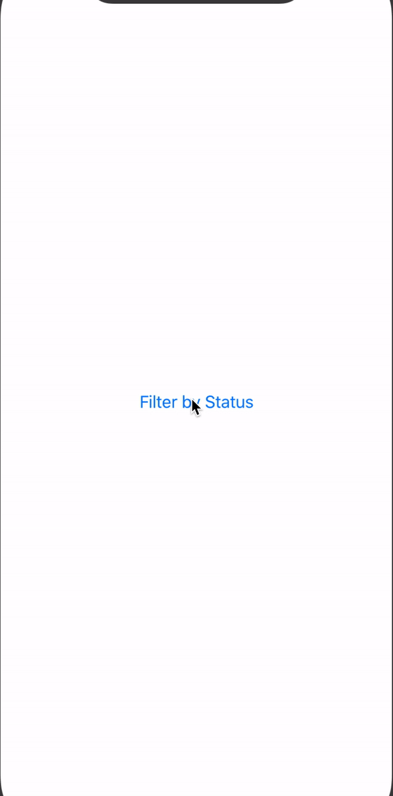

# Filter Bar



## Props

| Prop                        | Default | type     | Desc                                                                                                               |
| --------------------------- | ------- | -------- | ------------------------------------------------------------------------------------------------------------------ |
| icon(optional) | 'filter' | [FontAwesome5](https://oblador.github.io/react-native-vector-icons/) | name of the icon |
| isVisible | false | boolean  | If `true` filter bar will be visible |
| onCancelButtonPress(optional) | | function | Callback that is called when the cancel button was clicked |
| text(optional) | 'Filter bar' | string | text to show filter parameter |

## Usage

```javascript
import React, { useState } from 'react';
import { StyleSheet, Button } from 'react-native';
import  { FilterBar } from 'react-native-common-ux-kit';
import { SafeAreaView } from 'react-native-safe-area-context';
function App() {
  const [isFilterBarVisible, setIsFilterBarVisible] = useState(false);
  return (
    <SafeAreaView style={styles.container}>
      <FilterBar isVisible={isFilterBarVisible} text='Status' onCancelButtonPress={() => setIsFilterBarVisible(false)}/>
      <Button title='Filter by Status' onPress={() => setIsFilterBarVisible(true)} />
    </SafeAreaView>
  );
}

export default App;

const styles = StyleSheet.create({
  container: {
    flex: 1,
    alignItems: 'center',
    justifyContent: 'center',
    padding: 20,
  },
});

```
