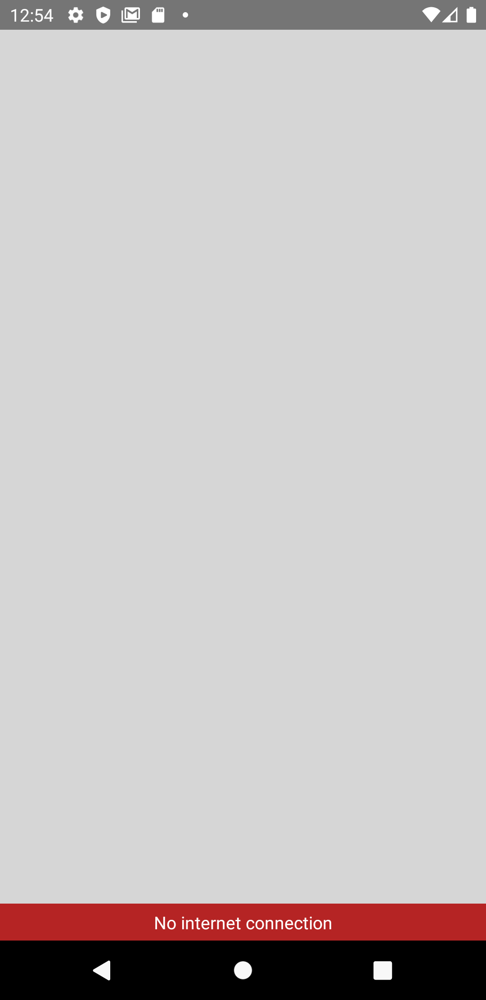

# Offline notification



## Usage

```javascript
import React, { useState } from 'react';
import { StyleSheet, View, Button } from 'react-native';
import { OfflineNotification } from 'react-native-common-ux-kit';

export default function App() {
  const [isVisible, setIsVisible] = useState(false);
  const [duration, setDuration] = useState({ hour: '0', minute: '0'});
  return (
    <View style={styles.container}>
      <Button
        onPress={() => setIsVisible(!isVisible)}
        title={`${duration.hour}:${duration.minute}`}
      />
      <OfflineNotification disableScreen/>
    </View>
  );
}

const styles = StyleSheet.create({
  container: {
    flex: 1,
    alignItems: 'center',
    justifyContent: 'center',
  },
});
```

### Props

| Prop                        | Default | type     | Desc                                                                                                               |
| --------------------------- | ------- | -------- | ------------------------------------------------------------------------------------------------------------------ |
| position(optional) |  'bottom'  | 'top \| bottom' | position of notification on the screen  |
| text(optional) | 'No internet connection' | string  | notification text |
| disableScreen(optional) | false | boolean | forbid to tap on the screen
