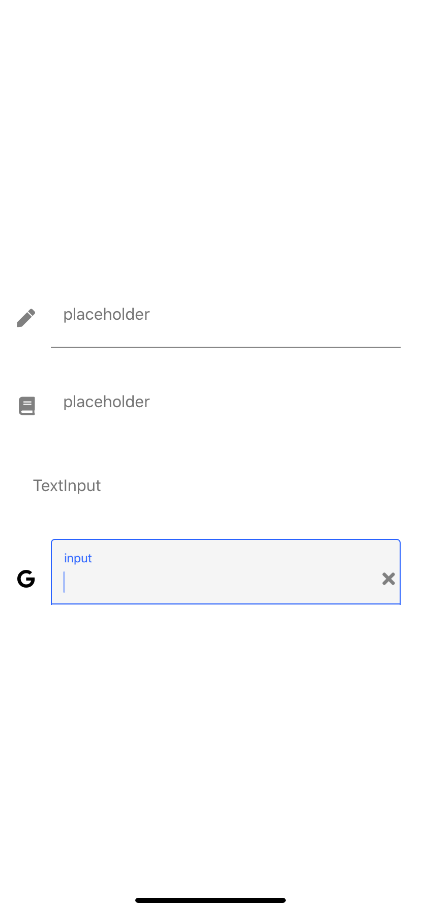
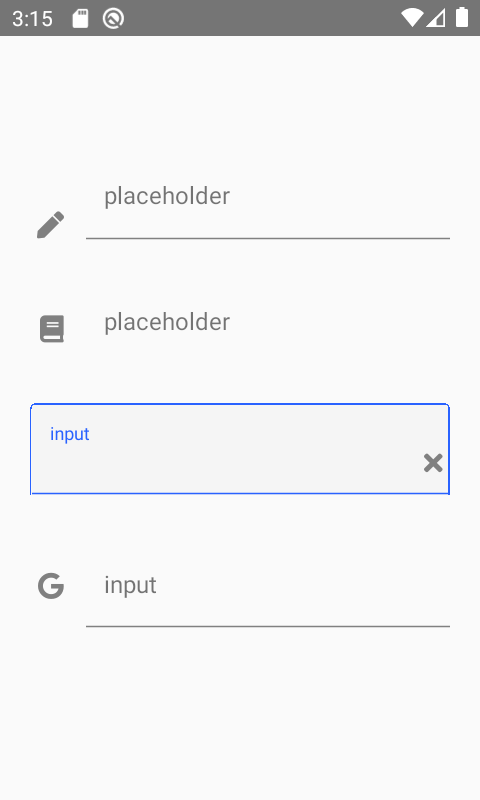

# Duration Picker



## Props

| Prop                        | Default | type     | Desc                                                                                                               |
| --------------------------- | ------- | -------- | ------------------------------------------------------------------------------------------------------------------ |
| caretHidden(optional) | false | boolean | is show caret  |
| clearButton(optional) | true | boolean | is show clear button |
| editable(optional) | true | boolean | If false, text is not editable.
| errorMessage(optional) | | string | message to show when ```showError``` is ```true```
| hintMessage(optional) | | string | message to show when ```showHint``` is ```true``` |
| icon(optional) | | string | icon to show |
| keyboardType(optional) |  | [type](https://reactnative.dev/docs/textinput#keyboardtype) | type of keyboard |
| placeholder(optional) | | string | The string that will be rendered before text input has been entered.|
| label(optional) |  | string | The text to use for the floating label |
| maxLength(optional) |  | [type](https://reactnative.dev/docs/textinput#maxlength) | Limits the maximum number of characters that can be entered. |
| multiline(optional) | false | boolean | If ```true```, the text input can be multiple lines |
| numberOfLines(optional) | 1 | number | Sets the number of lines for a TextInput. Use it with multiline set to true to be able to fill the lines. |
| secureTextEntry(optional) | false | boolean | If true, the text input obscures the text entered so that sensitive text like passwords stay secure. |
| showError(optional) | false | boolean | If ```true``` ```errorMessage``` will be shown |
| showHint(optional) | false | boolean | If ```true``` ```hintMessage``` will be shown |
| textContentType(optional) |  | string | [textContentType](https://reactnative.dev/docs/textinput#textcontenttype) |
| underline(optional) | true | boolean |  |
| value(optional) | '' | string | The value to show for the text input |
| customLeftButton(optional) | | { onPress: function, icon: string } | custom left button |
| onBlur(optional) | | function | Callback that is called when the text input is blurred. |
| onChangeText |  | function | Callback that is called when the text input's text changes. |
| onClear(optional) | | function | Callback that is called when the ```clearButton``` was clicked|
| onClick(optional) | | function | Callback that is called when the Text Input was clicked|
| onSubmitEditing(optional) | | function | Callback that is called when the text input's submit button is pressed|
| render(optional) | | function | Callback to render a custom input component such as react-native-text-input-mask instead of the default TextInput component from react-native |
| iconStyle(optional) |  | style | style of the icon |
| style(optional) |  | style | input container style |


## Usage

```javascript
import React, { useState } from 'react';
import { StyleSheet, View } from 'react-native';
import  { TextInput } from 'react-native-common-ux-kit';

function App() {
  const [text, setText] = useState('');
  return (
    <View style={styles.container}>
      <TextInput onChangeText={setText} value={text} icon="pen" placeholder="placeholder" multiline/>
      <TextInput label="input" onChangeText={setText} value={text} icon="book" placeholder="placeholder" underline={false}/>
      <TextInput label="input" placeholder="TextInput" onChangeText={setText} value={text} underline={false}/>
      <TextInput label="input" placeholder="TextInput" onChangeText={setText} value={text} icon="google" multiline/>
    </View>
  );
}

const styles = StyleSheet.create({
  container: {
    flex: 1,
    alignItems: 'center',
    justifyContent: 'center',
    padding: 20,
  },
});

```
